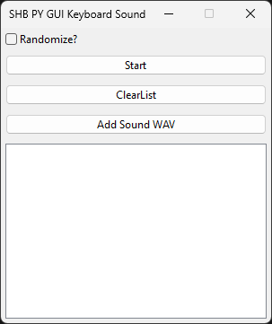

# rf_keyboard_sound - App That Plays Sound When Keyboard is Pressed

[README dengan Bahasa Indonesia Klik di Sini](https://github.com/rakifsul/rf_keyboard_sound/blob/main/README_id.md)

## Intro

This software is an application for playing sounds when the keyboard is pressed...

We can register one or more .wav files within this application to be played.

The application monitors the state of the keyboard.

If a key press is detected, the procedure to play the sound will be executed.

## Where to Download

Download this app on "Releases" page.

## Where are the Source Codes

Source codes are included in the zip along with the executables.

## How to Use

Find the exe, then run it.

## Screenshot

	

## Freelance Worker Link

- https://projects.co.id/public/browse_users/view/99bc11/rakifsul