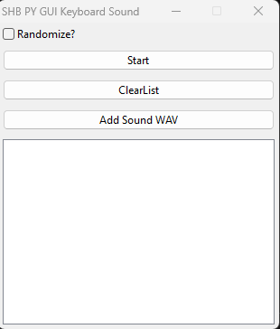

# rf_keyboard_sound - Aplikasi yang Mengeluarkan Suara saat Keyboard Ditekan

Software ini adalah aplikasi untuk memainkan suara saat keyboard ditekan...

Kita bisa mendaftarkan satu atau lebih file .wav di dalam aplikasi ini untuk dimainkan.

Aplikasi ini memonitor keadaan dari keyboard.

Jika terdeteksi ditekan, maka prosedur untuk memainkan suara akan dijalankan.

## Download di Mana

Download aplikasi ini di halaman "Releases".

## Cara Penggunaan

Temukan exe-nya, lalu jalankan.

## Screenshot

	

